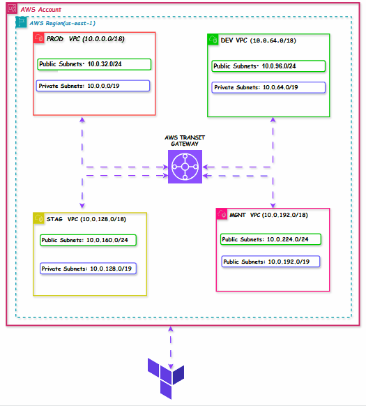

# Hub-and-spoke network architecture using AWS Transit Gateway: Multi-environment VPC with Transit Gateway in Terraform


## Introduction
In this project, we will be building a scalable and secure multi-environment VPC in AWS using AWS Transit Gateway. This project  demonstrates how you can connect multiple VPCs together and how you can control the traffic flow between the VPCs using a centralized hub-and-spoke architecture pattern. 

### Project Overview
This networking project shows how to implement a modern, enterprise-grade network architecture that will address the usual complexity of managing multiple VPCs across different environments using VPC peering. Using  AWS Transit Gateway as the central hub ,in this hub-spoke network architecture, you create a network topology that simplifies connectivity between VPCs, improves security, and provides a scalable network which can you can connect to VPN and on prem infrastructure.
The project was implemented using Terraform, the widely used and most popular IaC tool. Using IaC and security best practices ensures reproducible, version-controlled, consistent deployment across multiple AWS regions and environments, and maintainable network infrastructure.

### Project Architecture


### Project Architecture Components
This project was implemented with the below component:

1. Multi-Environment VPC Design: Isoalated  VPCs for production, staging, development, and management.
2. Centralized Transit Gateway Hub: A single point of connectivity and routing control
3. Segmented Route Tables: Isolated routing domains for different environment types
4. Security Group Integration: Granular security controls at the instance and application level
5. Terraform Infrastructure: Complete IaC implementation for reproducible deployments
7. Monitoring and Logging: Comprehensive observability through CloudWatch and VPC Flow Logs


### Prerequisites

## Building a hub-and-spoke network in AWS 

### Step 1: Set Up Project Structure
The first step is to setup the overall project with all the neccessory files. 

```bash
terraform-infrastructure/
├── main.tf                           # Main configuration using modules
├── variables.tf  
├── terraform.tfvars                     # Root variables
├── outputs.tf  
├── Readme.md
├── .gitignore       
├── modules/
│   ├── vpc/
│   │   ├── main.tf                   # VPC resources
│   │   ├── variables.tf              # VPC module variables
│   │   └── outputs.tf                # VPC module outputs
│   ├── transit-gateway/
│   │   ├── main.tf                   # Transit Gateway resources
│   │   ├── variables.tf              # TGW module variables
│   │   └── outputs.tf                # TGW module outputs
│   └── security/
│       ├── main.tf                   # Security Groups & NACLs
│       ├── locals.tf                 # Local transformations
│       ├── variables.tf              # Security module variables
│       └── outputs.tf                # Security module outputs
└── images/                          # contains diagrams and other related images 
   
```

### Step 2: Configure Provider, Backend and Variables
IN this second step we will configure the provider , backend and variables.

**Writing the Configuration for the provider**
In the provider configuration , we are using the AWS provider with  terraform verssion not less than 1.0.0
The region and profile are defined as variables.
```bash  

terraform {
  required_providers {
    aws = {
      source  = "hashicorp/aws"
      version = "~> 5.0"
    }
  }  
  required_version = ">= 1.0.0"

}

provider "aws" {
  region  = var.aws_region
  profile = var.aws_profile
}
```

**Writing the Configuration for variables**
The variables configuration contains all the  necessory varaibles definitions  and validations to make sure your code does not break. 
```bash
# 

variable "aws_region" {
  description = "AWS region to deploy resources"
  type        = string
  default     = "us-east-1"

validation {
    condition     = can(regex("^(us|eu|ap|sa|ca)-[a-z]+-[1-9][0-9]$", var.aws_region))
    error_message = "Invalid AWS region format. Use 'us-east-1', 'eu-west-1', etc."
  }
  

  validation {
    condition     = length(var.aws_region) > 0
    error_message = "AWS region cannot be empty."
  }

  validation {
    condition     = can(regex("^[a-z0-9-]+$", var.aws_region))
    error_message = "AWS region must consist of lowercase letters, numbers, and hyphens only."
  }
}


variable "aws_profile" {
  description = "AWS CLI profile to use"
  type        = string
  default     = "wewoli"

validation {
    condition     = length(var.aws_profile) > 0
    error_message = "AWS profile cannot be empty."
  }

  validation {
    condition     = can(regex("^[a-zA-Z0-9_]+$", var.aws_profile))
    error_message = "AWS profile must consist of alphanumeric characters and underscores only."
  }

}


variable "prod_vpc_cidr" {
  description = "CIDR block for production VPC"
  type        = string
  default     = "10.0.0.0/18"


}

variable "dev_vpc_cidr" {
  description = "CIDR block for development VPC"
  type        = string
  default     = "10.0.64.0/18"
}

variable "staging_vpc_cidr" {
  description = "CIDR block for staging VPC"
  type        = string
  default     = "10.0.128.0/18"

}

variable "mgnt_vpc_cidr" {
  description = "CIDR block for management VPC"
  type        = string
  default     = "10.0.192.0/18"

}


variable "availability_zones" {
  description = "List of availability zones"
  type        = list(string)
  default     = ["us-east-1a", "us-east-1b", "us-east-1c", "us-east-1d"]
  validation {
    condition     = length(var.availability_zones) > 0
    error_message = "At least one availability zone must be specified."
  }
}

variable "environment" {
  description = "Environment/Project name"
  type        = string
  default     = "multi-env"

  validation {
    condition     = length(var.environment) > 0
    error_message = "Environment name cannot be empty."
  }
}
```

**Writing the Configuration for backend**
The backend is configured to use remote backend using Amazon S3 to store the state and  DynamoDb for state locking. The backend configurations properties are difined using partial configurations in  `state.config` file. These details are passed during the init phase  using the command `terraform init -backend-config="./state.config"`
```bash
# backend.tf
terraform {
  backend "s3" {
    bucket         = ""
    key            = ""
    region         = ""
    profile        = ""
    dynamodb_table = ""
    encrypt        = true
  }

}
```

```bash
# state.config
region = "us-east-1"
profile= "wewoli"
bucket = "multi-env-hub-spoke-terraform-state" 
key    = "multi-env-terraform.tfstate"
dynamodb_table = "multi-env-terraform-state-lock"
  
```
### Step 3: Create modules 
Some components in this project are build as modules to ensure code reusability. There are  three modules in all
1. VPC : A resuable module that has all the necessory configuration to create a VPC.
2. Security: Contains configurations for creating security groups and network ACLs
3. Transit Gateway: Configurations for  creating a Transit Gateway.

All these modules have , varibles , outputs and main terraform definition files. There is also test file in each module that is used for unit testing and integration testing using Terraform Test framework

### Step 4: Create the Main Terraform Configuration

#### Step 1: Define Your VPCs using the VPC module

#### Step 1: Create Transit Gateway with attachments

#### Step 2: Configure Route Tables

#### Step 3: Implement Network ACLs with Least-Privilege Access

#### Step 7: Create Security Groups with Least-Privilege Access

### Step 8: Define Outputs

### Step 9: Deploy the Infrastructure

### Step 10: Verify Your Deployment

### Cleanup Instructions

## ERRORS and Troubleshooting

**1. Error: Invalid value for variable**

code causing error:
```bash
validation {
    condition     = can(regex("^10\\.1\\.((25[0-5]|2[0-4]\\d|1\\d\\d|[1-9]?\\d))\\.((25[0-5]|2[0-4]\\d|1\\d\\d|[1-9]?\\d))$", var.dev_vpc_cidr))
    error_message = "The CIDR block must be a valid private IP range."
  }
```
description:  
```bash
on variables.tf line 33:
│   33: variable "dev_vpc_cidr" {
│     ├────────────────
│     │ var.dev_vpc_cidr is "10.1.0.0/16"
│
│ The CIDR block must be a valid private IP range.
│
│ This was checked by the validation rule at variables.tf:36,3-13.
```
Solution:
combining `anytrue` function with `can` functions

```bash
validation {
    condition     = anytrue([can(regex("10(?:\\.(?:[0-1]?[0-9]?[0-9])|(?:2[0-5]?[0-9])){3}\\/", var.dev_vpc_cidr)), can(regex("172\\.(?:3?[0-1])|(?:[0-2]?[0-9])(?:\\.[0-2]?[0-5]?[0-9]){2}\\/(?:1[6-9]|2[0-9]|3[0-2])", var.dev_vpc_cidr))])
    error_message = "Must be a valid IPv4 CIDR block address."
  }
```

**2. Error: Invalid value for variable**

```bash
│ Error: Invalid value for variable
│ 
│   on main.tf line 482, in module "prod_vpc":
│  482:   tags = {
│  483:     Environment = "production"
│  484:     Project     = var.environment
│  485:   }
│     ├────────────────
│     │ var.tags is map of string with 2 elements
```

**code causing error:**

```bash
   validation {
    condition = alltrue([for k, v in var.tags : can(regex("^[a-zA-Z0-9_-]+$", k)) && can(regex("^[a-zA-Z0-9_\\s-]+$", v)) ])
    error_message = "Tags can only contain alphanumeric characters, underscores, and hyphens."
  }
```


**Solution**
```bash
 validation {
    condition = alltrue([for k, v in var.tags : can(regex("^[a-zA-Z0-9_-]+$", k)) && can(regex("^[a-zA-Z0-9_\\s-]+$", v)) ])
    error_message = "Tags can only contain alphanumeric characters, underscores, and hyphens."
  }
```

**3. Error: api error NetworkAclEntryAlreadyExists**
```bash
│ Error: api error NetworkAclEntryAlreadyExists: EC2 Network ACL (acl-07ff779bf652f56c6) Rule (egress: false)(110) already exists
│
│   with module.security.aws_network_acl_rule.ingress["dev_private-ingress-internal"],
│   on modules\security\main.tf line 52, in resource "aws_network_acl_rule" "ingress":
│   52: resource "aws_network_acl_rule" "ingress" {

```
**4. Error: Error: Error loading state:**
```bash
│ Error: Error loading state:
│     Unable to access object "multi-env/terraform.tfstate" in S3 bucket "multi-env-hub-spoke-terraform-state": operation error S3: HeadObject, https response error StatusCode: 403, RequestID: 8BDXRAT0PPCQ4EZQ, HostID: 7jML04CBlhOC91fqrDc4W0sZUqrO2nWE8RnJ7COrDwGh9XMo8yI+EXLphvXuJG4bYR5p18kjv7FKa99xLkW/DWIYhI1VAIs022v2AUpbxsg=, api error Forbidden: Forbidden
│
│ Terraform failed to load the default state from the "s3" backend.
│ State migration cannot occur unless the state can be loaded. Backend
│ modification and state migration has been aborted. The state in both the
│ source and the destination remain unmodified. Please resolve the
│ above error and try again.
```

**Solution:**
The authentication for the S3 backend is handled separately from the authentication of the provider. The S3 backend uses the default profile for authentication  if you do not provide any profile. If you have two different AWS profiles configured in `~/.aws/credentials`, the S3 backend will use the default profile. You will get this error if the default credentials does not have the  permissions to access your s3 bucket. You can specify the profile in the backend config like seen bellow.

```bash
terraform {
  backend "s3" {
    bucket         = "multi-env-hub-spoke-terraform-state"
    key            = "multi-env-terraform.tfstate"
    region         = "us-east-1"
    profile        = "wewoli"
    dynamodb_table = "multi-env-terraform-state-lock"
    encrypt        = true
  }

}
```

you can also use partial configuration as shown bellow.  To specify a file, use the -backend-config=PATH option when running terraform init. 

```bash
terraform init -backend-config="./state.config"
```

**partial configuration**
```bash
# state.tf
terraform {
  backend "s3" {
    bucket = "" 
    key    = ""
    region = ""
    profile = ""
  }
}
```

```bash
# state.config
bucket = "your-bucket" 
key    = "your-state.tfstate"
region = "eu-central-1"
profile= "Your_Profile"

```

**4.Error: validating provider credentials:**
```bash
Error: validating provider credentials: retrieving caller identity from STS: operation error STS: GetCallerIdentity, https response error StatusCode: 0, RequestID: , request send failed, Post "https://sts.us-east-1.amazonaws.com/": dial tcp: lookup sts.us-east-1.amazonaws.com: no such host
```

**Solution**
This is caused by network failure. Make sure you  internet connection is good.

## Future Additions and Considerations

To enhance this project in the furure, i will be adding these features.
1. NAT gateways for private subnets to access the internet
2. Implement  VPC flow logs for network monitoring
3. Separate AWS accounts for each environment, connected via Resource Access Manager (RAM)
4. Automate this using CI/CD pipeline


